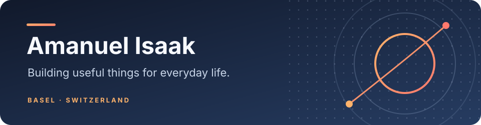

  Basel, Switzerland · Incoming <a href="https://www.fhnw.ch/en/business/degree-programmes/offerings/programmes/bachelor-in-business-information-technology">Business Information Technology student at FHNW</a>

I like turning everyday questions into useful apps: *What can I safely spend? Where should I move? What is changing in my city?* My projects usually start with one of those questions and grow into a native app or a small web tool.

### Things I’m building

| Project | The idea |
| --- | --- |
| **Budgetli** | A clearer picture of what’s safe to spend, with budgeting and relevant savings for young people around Basel. Android, iPhone, and web. |
| **Wishpin** | A home for food spots, things to buy, and places to go. Wishes can connect to savings goals in Budgetli. |
| **BauRadar Basel** | A map and timeline of major construction projects around Basel, with official sources and checked dates. |
| **Ortsblick** · *in progress* | A way to compare Swiss places before moving, using public data on commutes, taxes, noise, hazards, and more. |

The code for these projects is private while I’m working on them. I’ll add demos and source links as they become ready to share.

### Languages I reach for

  
  
  
  

I use **Kotlin Multiplatform** for shared rules, **Jetpack Compose** and **SwiftUI** for native interfaces, and **React** when a tool belongs on the web. I care about clear interfaces and showing where data comes from.

Language icons from <a href="https://github.com/tandpfun/skill-icons">skill-icons</a> (MIT license).
